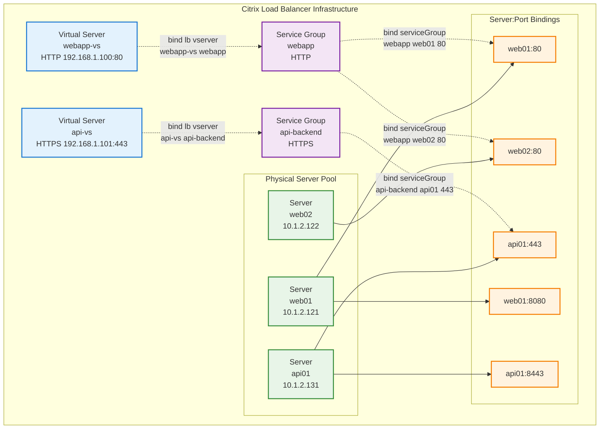

# Traefik7

An parser to extract L7 settings to Traefik services🚀🚀🚀

## Build

```bash
go build -o traefik7 .
```

## Usage

```bash
./traefik7 <input-file>
```

The tool parses L7 load balancer configuration files and generates:
- Traefik loadBalancer services configuration in YAML format
- Mapping rules with @nacoscs suffix in YAML format

Both files are generated in a timestamp-named directory (format: YYYYMMDDHHMM) in the current working directory.

## Example

# L7traefik

A complete Go-based command line tool that parses L7 load balancer configuration files and generates Traefik-compatible YAML configurations.

## Citrix Load Balancer Concept Hierarchy

This tool parses Citrix/NetScaler load balancer configurations and converts them to Traefik format. Understanding the Citrix concept hierarchy is essential for proper configuration migration.

### Citrix Concept Hierarchy



### Citrix Component Hierarchy

1. **Server** - Physical backend servers that handle actual requests
   - Defined with: `add server <name> <ip>`
   - Example: `add server web01 10.1.2.121`
   - **Key Point**: One server can listen on multiple ports

2. **Service Group** - Logical grouping of servers providing the same service
   - Defined with: `add serviceGroup <name> <protocol>`
   - Bound with: `bind serviceGroup <name> <server> <port>`
   - **Key Point**: Groups server:port combinations, not just servers

3. **Virtual Server (VServer)** - External-facing load balancer endpoint
   - Defined with: `add lb vserver <name> <protocol> <ip> <port>`
   - Example: `add lb vserver webapp-vs HTTP 192.168.1.100 80`
   - **Key Point**: Can be bound to zero or more service groups

4. **VServer Binding** - Connection between virtual servers and service groups
   - Defined with: `bind lb vserver <vserver> <servicegroup>`
   - **Key Point**: Creates the routing from external endpoint to server pool

### Relationships Summary

- **1 Virtual Server** → **0 or more Service Groups** (via bind lb vserver)
- **1 Service Group** → **0 or more Server:Port combinations** (via bind serviceGroup)
- **1 Server** → **Multiple Ports** (each server can listen on different ports)
- **Traffic Flow**: Client → Virtual Server → Service Group → Server:Port

### Conversion Process

The tool transforms Citrix configurations into Traefik-compatible formats:

- **Service Groups + Servers** → **Traefik Services with LoadBalancer**
- **Virtual Servers** → **Mapping entries (IP:Port → Service@nacoscs)**

## Features

The tool accepts L7 setting files containing commands like:

- `add server <name> <ip>` - Define server mappings
- `add lb vserver <name> <protocol> <ip> <port>` - Define virtual servers
- `bind serviceGroup <name> <server> <port>` - Bind servers to service groups

And generates two output files in a timestamp-named directory:

- `traefik-services.yaml` - Traefik HTTP services configuration with loadBalancer settings
- `mapping.yaml` - IP:port to service@nacoscs mappings

## Build

```bash
go build -o traefik7 .
```

## Usage

```bash
./traefik7 <input-file>
```

## Example

Given this input:

```
add server highavailableapplicationap001 10.1.2.121
add server highavailableapplicationap002 10.1.2.122
add server highavailableapplicationap003 10.1.2.123
add lb vserver targetapplicationserver:8351 HTTP 10.0.28.130 8351
bind serviceGroup targetapplicationserver:8351 highavailableapplicationap001 8351
bind serviceGroup targetapplicationserver:8351 highavailableapplicationap002 8351
bind serviceGroup targetapplicationserver:8351 highavailableapplicationap003 8351
```

The tool generates:

**traefik-services.yaml:**
```yaml
http:
  services:
    targetapplicationserver:8351:
      loadBalancer:
        servers:
          - url: http://10.1.2.121:8351
          - url: http://10.1.2.122:8351
          - url: http://10.1.2.123:8351
```

**mapping.yaml:**
```yaml
10.0.28.130:8351: targetapplicationserver:8351@nacoscs
```

Generated output:
- `traefik-services.yaml`: Traefik services configuration
- `mapping.yaml`: Service mapping rules
